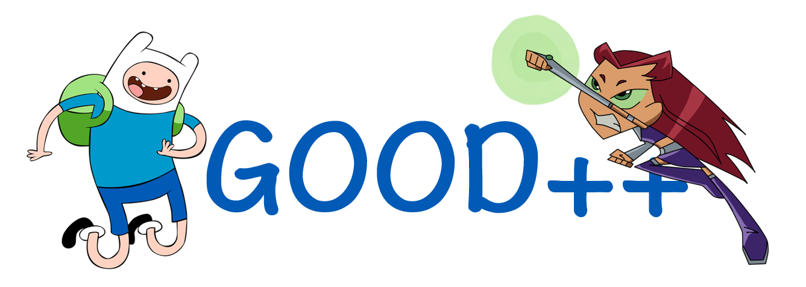

  
   推荐一些Github上很赞的开源项目，帮你寻找有趣的灵魂！

## Overview

Good++项目是由几个程序员利用业余时间发起的，收集那些github上有趣、好玩的开源项目。
项目涉猎前端、后台、app开发、数据库等方面，并且我们更倾向于推荐国内开源项目，每一期介绍2-5个项目配有图片和文字说明。
我们也非常欢迎您提交自己的项目，您可以通过issue或者pr的方式来提交自己的项目，万分欢迎！

## 期刊

* ##### [第十期](./content/10.md)
* ##### [第九期](./content/09.md)
* ##### [第八期](./content/08.md)
* ##### [第七期](./content/07.md)
* ##### [第六期](./content/06.md)
* ##### [第五期](./content/05.md)
* ##### [第四期](./content/04.md)
* ##### [第三期](./content/03.md)
* ##### [第二期](./content/02.md)
* ##### [第一期](./content/01.md)

欢迎[推荐或自荐项目](https://github.com/DeformedSteel/good/issues/new)成为 **GOOD++** 的[贡献者](https://github.com/DeformedSteel/good/blob/master/contributors.md)

## License
GOOD++ is released under the MIT License. [http://www.opensource.org/licenses/mit-license](http://www.opensource.org/licenses/mit-license)
