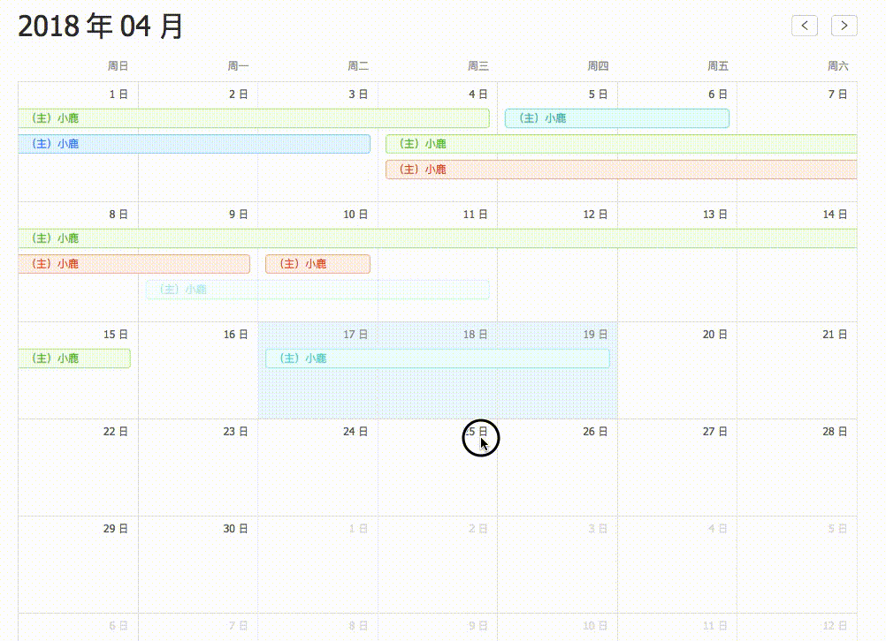

  
   推荐一些Github上很赞的开源项目，帮你寻找有趣的灵魂！

## drag-calendar

### 项目地址: 
[https://github.com/ProtoTeam/drag-calendar](https://github.com/ProtoTeam/drag-calendar)

### 截图:

  

### 介绍:
一个可拖拽的日历组件,具有一下特点

* 拖拽已有事件
* 双击添加事件
* 左右拖拽事件
* 拖拽空白区域新建事件

除了功能之外，还有用户可用性上的细节打磨：

* 拖拽已有事件的阴影效果
* 拖拽已有事件拖拽中隐藏
* 左右拖拽的预览以及阴影效果
* 事件智能布局，包括堆叠和换行后的冗余清理
* 拖拽态的处理(偏移量计算以及dragLayer的重写)

---

## concent

### 项目地址: 
[https://github.com/concentjs/concent](https://github.com/concentjs/concent)

### 截图:

  
  

### 介绍:

concent是一个专为react提供状态管理服务的框架，提炼现有各大框架的精华，以及社区公认的最佳实践，通过良好的模块设计，既保证react的最佳性能又允许用户非常灵活的解耦UI逻辑与业务逻辑的关系，从整体上提高代码的可读性、可维护性和可扩展性。
concent携带以下特性

* 核心api少且简单，功能强大，上手容易，入侵小，容易调试
* 提供全局模块化的单一数据源
* 支持0入侵的方式，渐进式的重构已有react代码
* 对组件扩展了事件总线、computed、watch、双向绑定等特性
* 完美支持function组件
* 基于引用定位和状态广播，支持细粒度的状态订阅，渲染效率出众
* 支持中间件，可以扩展你的个性化插件处理数据变更
* 支持react 0.10+任意版本；

### 期待您的推荐!