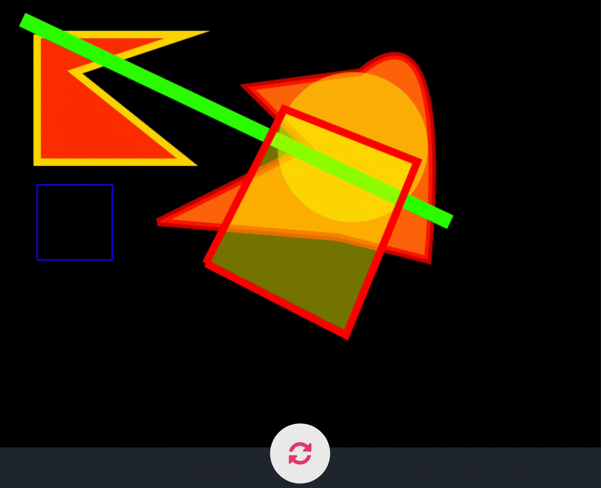
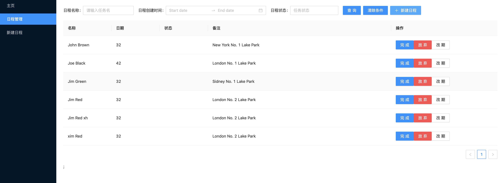
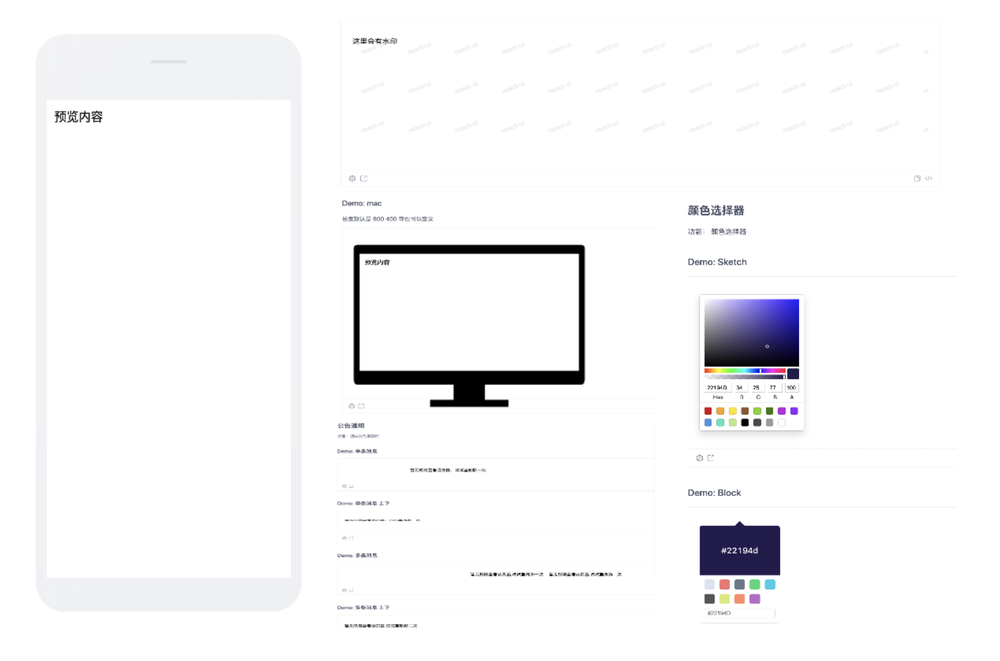
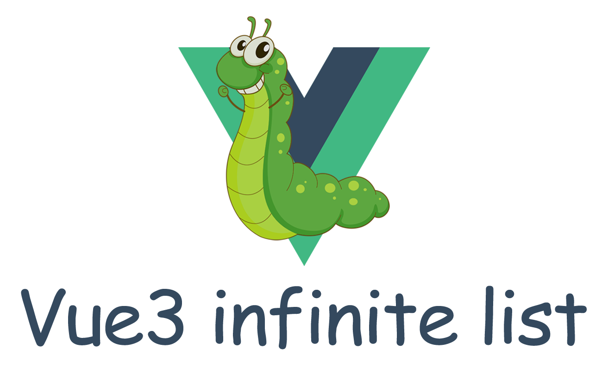

<p align="center">
  
  <br>推荐一些Github上很赞的开源项目，帮你寻找有趣的灵魂！
</p>

## 《InkPaint》

### 项目地址:

[https://github.com/drawcall/inkpaint](https://github.com/drawcall/inkpaint)

### 截图: 

<p align="center">
  
</p>

<p align="center">
  
</p>

### 介绍:

InkPaint是一个轻量级node.js side canvas图形渲染框架。
您可以使用它进行服务器端动态图像合成，在serve端可以进行图片添加水印、修改颜色、diy拼图、合成pdf等操作。

---

```sh
npm install inkpaint
```

```js
const fs = require("fs-extra");
const { Application, Sprite, Ticker, Loader } = require("inkpaint");

const width = 800;
const height = 600;

const app = new Application(width, height);
const loader = new Loader();
loader.add("boy", "./assets/boy.png");
loader.load(loaded);

function loaded(loader, resources) {
  const boy = new Sprite(resources.boy.texture);
  boy.x = width / 2;
  boy.y = height / 2;
  boy.anchor.set(0.5);
  app.stage.addChild(boy);
}

const ticker = new Ticker();
ticker.start();
ticker.add(() => {
  app.render();
  boy.x += 0.1;
});

// save image
const buffer = app.view.toBuffer("image/png");
fs.outputFile("./hello.png", buffer);
```

---

## 《daymanage》

### 项目地址:

[https://github.com/xlei1123/daymanage](https://github.com/xlei1123/daymanage)

### 截图:

<p align="center">
  
</p>

### 介绍:

基于umi3开发的日程管理系统
包括新建日程 日程列表， 打通微信， 定时推送日程 喜欢的帮忙点个star

```javascript
.
├── README.md
├── dist // 打包后输出文件目录
├── jest.config.js // 单元测试配置
├── mock // mock数据文件
├── package.json
├── public // 静态文件目录 可以直接```/a.txt```这样访问
│   └── a.txt
├── src
│   ├── components // 公共组件
│   ├── config // 常用配置
│   ├── global.css // 全局css 文件
│   └── pages // 页面
├── test // 测试文件目录
│   └── index.test.js
├── tsconfig.json // ts配置
└── typings.d.ts
```

---

## 《mouse-ui》

### 项目地址:

[https://github.com/xlei1123/mouse-ui](https://github.com/xlei1123/mouse-ui)

### 截图:


<p align="center">
  
</p>

### 介绍:

常用不常见的reactui组件，总有一款你需要的：颜色选择器，角标，全屏，PC上h5预览，拖拽，水印, 倒计时等等。mouse-ui 集成了项目中一些常用但不常见的组件。在这里你总会发现一些惊喜。

- 🌈 复杂组件。
- 📦 开箱即用的高质量 React 组件。
- 🛡 使用 TypeScript 开发，提供完整的类型定义文件。
- 🎨 深入每个细节。

---

## 《awesome-fe-team》

### 项目地址:

[https://github.com/xlei1123/awesome-fe-team](https://github.com/xlei1123/awesome-fe-team)

### 截图:


<p align="center">
  
</p>

### 介绍:

这里收录了国内知名的前端团队的blog,github,经常去逛逛吧，帮助你了解国内前端的最新动态！！！

---


### 期待您的推荐!
